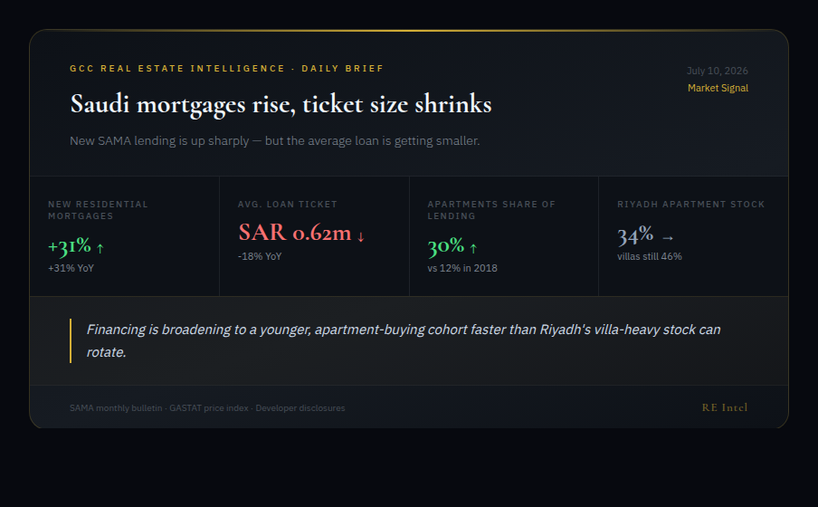

# GCC Real Estate Intelligence Bot

**A free-first, multi-tier intelligence cascade for Gulf real-estate news — 20 RSS feeds + government statistics (DLD / SAMA / GASTAT) + Reddit's `.json` API + Google-News-RSS as a no-login social proxy — feeding an LLM editorial pipeline that drafts ranked, KSA-focused LinkedIn post ideas you refine live through a stateful Telegram inline-keyboard flow.**



*Above: the actual HTML KPI card the bot renders for each draft (`build_infographic()`), shown here with illustrative figures. It is sent to Telegram as a document, ready to screenshot for a LinkedIn post.*

---

## Why it's interesting

Most "news bots" fetch one RSS feed and dump headlines. This one treats *source acquisition as a cost-optimisation problem*: it stitches five tiers of **entirely free** signals — press, official government portals, community sentiment, and an indirect social proxy — dedupes across all of them, and only then spends a token on an LLM. Nothing here calls a paid scraping API.

- **Free-first by design.** Every tier uses a public, no-auth surface: `feedparser` on RSS, Reddit's unauthenticated `.json` endpoint, and — the neat trick — **Google News RSS with `site:twitter.com` / `site:linkedin.com` queries** as a login-free proxy for social chatter. Zero API keys except the one LLM call.
- **A real editorial pipeline, not a summariser.** Two distinct LLM stages: one ranks the day's noise into 10 post *ideas* (each with a data angle and a "so what"), a second expands a chosen idea into a full draft **plus** a structured KPI infographic — with source-relevance scoring in between so each draft is grounded in the most on-topic articles.
- **Stateful, human-in-the-loop editing over Telegram.** The whole refine loop — *sharper tone / more data / opposite angle / shorter / investor focus*, or any free-text instruction — runs through inline-keyboard callbacks against a persisted state machine. Close the app, reopen, the draft is still there.
- **Honest about what it doesn't know.** The prompts forbid invented numbers ("write *estimated* or *reported* — never invent") and reject any idea that isn't tied to a concrete source line.

## How the cascade works

Five source tiers collapse into one deduped signal set, then the LLM stages take over:

```
 T1 RSS ×20        T2 gov HTML       T3 Reddit .json     T4 Google-News proxy    T5 forums
 (feedparser)      (DLD/SAMA/        (10 subs + 4        (X + LinkedIn via       (SkyscraperCity
  press + GNews     GASTAT, via       search.json         site: queries,          + PropertyFinder
  + CBRE)           BeautifulSoup)    queries)            no login)               blog)
      │                  │                 │                    │                     │
      └──────────────────┴────────┬────────┴────────────────────┴─────────────────────┘
                                   ▼
        keyword relevance  ·  48h recency window  ·  md5(title) cross-tier dedup
                                   ▼
        generate_ideas()  ──►  OpenRouter LLM  ──►  JSON array of 10 ranked idea cards
                                   │               (KSA-specialist system prompt)
                                   ▼
                    Telegram: 10 inline-keyboard buttons  ── tap one ──┐
                                                                       ▼
        generate_post()  ── relevance-scored top-8 articles as context ──►
              full LinkedIn draft  +  ---INFOGRAPHIC---  KPI JSON block
                                   │
              ┌────────────────────┼─────────────────────┐
              ▼                    ▼                       ▼
      build_infographic()   refine buttons          ✅ approve
      styled HTML KPI card   (tone / data / angle /   → copy-ready text
      → Telegram document     shorter / investor)         for LinkedIn
                              + free-text edits
```

## The mechanics, precisely

No hand-waving — here is exactly what the code does at each hinge (`gcc_re_intel_bot.py`):

| Stage | Mechanic |
|---|---|
| **Relevance filter** | An article survives Tier 1 only if `title + summary` (lower-cased) contains at least one of ~55 domain keywords (`neom`, `mortgage`, `off-plan`, `sama`, `roshn`, `freehold`, …), **and** its `published_parsed` date is within the last 48h. |
| **Cross-tier dedup** | Every article is keyed by `md5(title.lower())`; the first occurrence wins, so the same story surfacing on RSS *and* Reddit *and* Google News collapses to one row. |
| **Reddit tier** | Pulls `r/<sub>/new.json?limit=25&t=day` for 10 subreddits (no auth), keeps posts < 48h old that clear a **min-engagement gate** (`score ≥ 2` *or* `comments ≥ 1`), with a polite `1.5s` delay between subreddits, plus 4 targeted `search.json` queries. |
| **Idea generation** | Top 50 articles are labelled with a tier emoji and handed to a KSA-specialist system prompt; the model must return a **strict JSON array of exactly 10** ideas (`hook`, `angle`, `opportunity`, `sources_used`, `geography`, `topic`, `complexity`). A regex unwraps ```` ```json ```` fences and isolates the `[…]` payload before parsing. |
| **Post grounding** | For the chosen idea, each cached article is **scored** — `+3` if its source is in the idea's `sources_used`, `+2` on geography match, `+1` on topic match, `+2` if it's official-data, `+1` if it's social — and the **top 8** become the draft's context. |
| **Infographic** | The second LLM response carries a `---INFOGRAPHIC---` marker followed by KPI JSON; `build_infographic()` renders up to 4 KPI cards with up/down/flat arrows and colours into a self-contained HTML card sent to Telegram as a document. |
| **State machine** | `state.json` persists `{offset, ideas, selected, mode, last_post}`. The bot long-polls `getUpdates` (30s), routes `callback_query` (buttons) and `message` (commands + free-text) events, and only obeys the one configured `TELEGRAM_USER_ID`. |

## Tech stack

Python · feedparser · requests · BeautifulSoup4 · OpenRouter (default `deepseek/deepseek-chat`) · Telegram Bot API · systemd · cron

## Running it locally

```bash
python3 -m venv .venv && source .venv/bin/activate
pip install -r requirements.txt

# 1. Configure secrets
cp .env.example .env       # then fill in TELEGRAM_TOKEN, TELEGRAM_USER_ID, OPENROUTER_API_KEY

# 2. Dry-run every source (no Telegram traffic, no LLM calls)
python3 gcc_re_intel_bot.py --test

# 3. One-shot: scrape + push 10 idea cards to your Telegram
python3 gcc_re_intel_bot.py --scrape

# 4. Run the interactive editorial loop (long-running service)
python3 gcc_re_intel_bot.py --bot
```

`deploy.sh` wires the same thing up as a `systemd` service plus a daily `03:00 UTC` scrape cron (paths and service user are configurable via `APP_DIR` / `PYTHON` / `SERVICE_USER`).

### Configuration

All configuration is via environment variables (optionally seeded from a local `.env` — see `.env.example`):

| Variable | Purpose | Default |
|---|---|---|
| `TELEGRAM_TOKEN` | Bot token from @BotFather | — (required) |
| `TELEGRAM_USER_ID` | The only user id the bot will talk to | — (required) |
| `OPENROUTER_API_KEY` | LLM editorial pipeline | — (required) |
| `OPENROUTER_MODEL` | Model slug | `deepseek/deepseek-chat` |
| `OPENROUTER_REFERER` | Attribution referer for OpenRouter | `https://github.com` |
| `DATA_DIR` | Runtime state / cache / logs | `./.state` |
| `OUTPUT_DIR` | Generated infographics | `./output` |

## Data & privacy

This repository contains **code only**. It ships no scraped articles, no cached state, no generated posts, and no credentials. Every source it reads is a **public, no-authentication surface** — press RSS feeds, government open-data portals (DLD / SAMA / GASTAT), Reddit's public `.json` API, and Google News RSS. Secrets are read from the environment at runtime; `.env` is git-ignored and only `.env.example` (variable names, no values) is committed.

## License

MIT — see [LICENSE](LICENSE).
